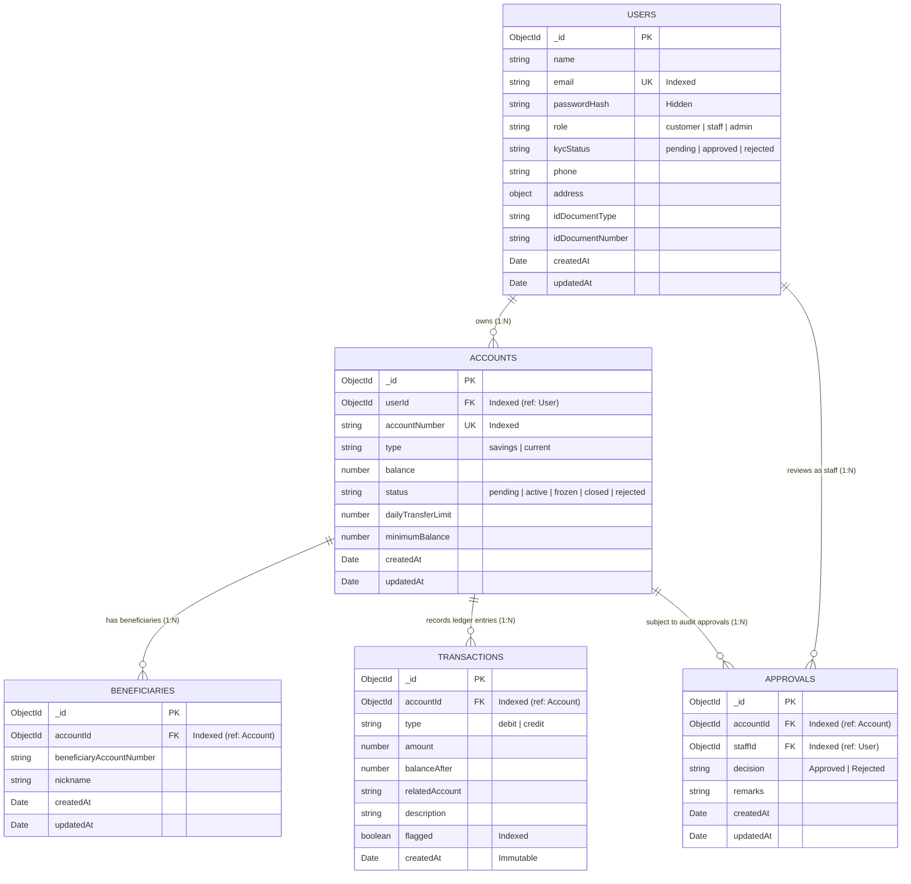

# P10 — Digital Banking Account & Transaction Management System

A robust, enterprise-grade backend foundation for a Digital Banking Account and Transaction Management System built with **Node.js, Express.js, MongoDB (Mongoose), JWT authentication, Role-Based Access Control (RBAC)**, and centralized error handling.

---

## Table of Contents
- [Problem Statement](#problem-statement)
- [Tech Stack](#tech-stack)
- [System Architecture & Schema Design](#system-architecture--schema-design)
  - [Entity-Relationship Diagram](#entity-relationship-diagram)
  - [Embed vs Reference Design Decisions](#embed-vs-reference-design-decisions)
- [Project Scaffold](#project-scaffold)
- [Module Ownership Breakdown](#module-ownership-breakdown)
- [API Documentation (Implemented Routes)](#api-documentation-implemented-routes)
- [Interest Calculation Assumptions](#interest-calculation-assumptions)
- [Role-Based Access Control (RBAC) Audit](#role-based-access-control-rbac-audit)
- [Architectural & Coding Conventions](#architectural--coding-conventions)
- [Setup & Installation Instructions](#setup--installation-instructions)
- [Testing & Postman Collection](#testing--postman-collection)

---

## Problem Statement
Modern digital banking systems demand absolute reliability, strict separation of concerns, secure identity verification, and multi-tier access control. 
This project establishes the core architecture and foundational micro-modules for customer onboarding, KYC (Know Your Customer) compliance capture, account application lifecycle and staff approval workflows, and beneficiary management. It serves as a consistent scaffold for a 3-engineer collaborative team to implement transactional processing, statements, account freezing, and administrative analytics without architectural friction.

---

## Tech Stack
- **Runtime Environment:** Node.js (v18+)
- **Framework:** Express.js (v4.x)
- **Database:** MongoDB
- **ODM:** Mongoose (v8.x)
- **Authentication & Security:** JSON Web Tokens (`jsonwebtoken`), `bcryptjs`, CORS
- **Request Validation:** Joi schema validation
- **Dev Tools:** Morgan (HTTP request logger), Nodemon

---

## System Architecture & Schema Design

### Entity-Relationship Diagram



```text
               +-----------------------------+
               |            USERS            |
               | (customer, staff, admin)    |
               +--------------+--------------+
                              |
                     1:N      |      1:N (Staff review)
           +------------------+------------------+
           |                                     |
           v                                     v
+--------------------------+          +-------------------------+
|         ACCOUNTS         |          |        APPROVALS        |
| (savings, current)       |          | (audit trail log)       |
+------------+-------------+          +------------+------------+
             |                                     ^
             | 1:N                                 | 1:N (Account audited)
             +-------------------------------------+
             |
             +--------------------+--------------------+
             | 1:N                                     | 1:N
             v                                         v
+--------------------------+               +--------------------------+
|      BENEFICIARIES       |               |       TRANSACTIONS       |
| (whitelisted recipients) |               | (immutable ledger stream)|
+--------------------------+               +--------------------------+
```

### Embed vs Reference Design Decisions
Each relationship in the Mongoose data models was deliberately chosen based on query isolation, write scalability, and document size safety:

1. **`User` (Root Entity)**: Users are kept as a top-level collection; accounts and audit logs link to `User` via `userId` and `staffId` to prevent unbounded nesting and allow atomic credential updates.
2. **`User` $\to$ `Account` (Reference via `userId`)**: Referenced because accounts experience frequent balance adjustments, independent lifecycle states (`pending`, `active`, `frozen`), and customers frequently open multiple savings/current accounts over time.
3. **`Account` $\to$ `Beneficiary` (Reference via `accountId`)**: Referenced to enable independent indexing, pagination, and compound uniqueness (`accountId` + `beneficiaryAccountNumber`) without bloating the parent account document.
4. **`Account` $\to$ `Transaction` (Reference via `accountId`)**: Referenced because transactional ledgers represent high-throughput, append-only immutable streams that would quickly exceed MongoDB's 16MB document size cap if embedded.
5. **`Account` & `User` $\to$ `Approval` (Reference via `accountId` and `staffId`)**: Referenced to maintain an immutable, tamper-evident regulatory audit trail with independent life cycle and search capabilities for compliance audits.

---

## Project Scaffold

```
project-root/
├── config/
│   └── db.js                        # MongoDB Mongoose connection
├── models/
│   ├── User.js                      # User model with KYC fields, bcrypt hook, and RBAC
│   ├── Account.js                   # Account model (savings/current, status, limits)
│   ├── Beneficiary.js               # Whitelisted recipient accounts
│   ├── Transaction.js               # Immutable ledger records
│   └── Approval.js                  # Audit log for staff account review decisions
├── middleware/
│   ├── auth.js                      # JWT protect & restrictTo RBAC guards
│   ├── validate.js                  # Joi schema validation middleware
│   └── errorHandler.js              # Centralized JSON error responder
├── utils/
│   ├── appError.js                  # Custom operational error class
│   ├── catchAsync.js                # Async route wrapper
│   ├── generateToken.js             # JWT signing utility
│   └── pagination.js                # Reusable page/limit/skip pagination helper
├── routes/
│   ├── auth.routes.js               # POST /register, POST /login
│   ├── user.routes.js               # GET /me, PUT /me
│   ├── account.routes.js            # POST /, GET /, GET /:id, PUT /:id/approve (+ stubs)
│   ├── beneficiary.routes.js        # POST /, GET /, DELETE /:id
│   ├── staff.routes.js              # GET /pending-accounts (+ stubs)
│   └── transaction.routes.js        # Stubs for Member 2 transfers
├── controllers/
│   ├── auth.controller.js           # Registration & Login handlers
│   ├── user.controller.js           # KYC & Profile retrieval and updates
│   ├── account.controller.js        # Account application, listing, and approval
│   ├── beneficiary.controller.js    # Beneficiary CRUD
│   ├── staff.controller.js          # Staff operations & review queue
│   └── transaction.controller.js    # Transaction stubs
├── .env.example                     # Environment variable template
├── .env                             # Local environment variables
├── .gitignore                       # Ignored files (node_modules, .env)
├── seed.js                          # Database seeder (Admin, Staff, Customers, Accounts)
├── P10_Digital_Banking.postman_collection.json # Comprehensive Postman test collection
├── server.js                        # Express server entrypoint
├── package.json                     # Dependencies and scripts
└── README.md                        # Documentation
```

---

## Module Ownership Breakdown

| Module | Scope / Description | Owner | Status |
|---|---|---|---|
| **Module 1** | **Customer Onboarding & KYC Capture** (Register, Login, Get/Update KYC Profile with Approval Lock) | **Foundation** | **Implemented & Tested** |
| **Module 2** | **Account Approval Workflow** (Account Application, Staff Pending Queue, Approval/Rejection with Audit Log & Conflict Checks) | **Foundation** | **Implemented & Tested** |
| **Module 3** | **Account Management** (List Own Accounts / Paginated All for Staff, Get Account Details with Ownership Verification) | **Foundation** | **Implemented & Tested** |
| **Module 4** | **Beneficiary Management** (Add Beneficiary with Active Check & Ownership Check, List Beneficiaries, Delete Beneficiary) | **Foundation** | **Implemented & Tested** |
| **Module 5** | **Fund Transfers & Transaction Processing** (`POST /api/transactions/transfer`, Ledger Records, Balance & Limit Checks) | **Member 2 (Sprint 2)** | **Implemented & Tested** |
| **Module 6** | **Transaction Ledger & Account Statements** (`GET /api/accounts/:id/transactions`, `GET /api/accounts/:id/statement`) | **Member 2 (Sprint 2)** | **Implemented & Tested** |
| **Module 7** | **Minimum Balance & Transfer Limits Enforcement** (Integrated inside transfer engine balance validation) | **Member 2 (Sprint 2)** | **Implemented & Tested** |
| **Module 8** | **Suspicious Transfer Threshold Detection** (Automatic `flagged: true` tagging for transfers exceeding $10,000 threshold) | **Member 2 (Sprint 2)** | **Implemented & Tested** |
| **Module 9** | **Suspicious Transaction Review & Listing** (`GET /api/staff/flagged-transactions`, `PUT /api/staff/flagged-transactions/:id/review`) | **Member 3 (Sprint 3)** | **Implemented & Tested** |
| **Module 10** | **Account Freeze & Unfreeze Controls** (`PUT /api/accounts/:id/freeze`, `PUT /api/accounts/:id/unfreeze`, Status Guarding) | **Member 3 (Sprint 3)** | **Implemented & Tested** |
| **Module 11** | **Automated Interest Calculation Service & Manual Endpoint** (`calculateInterestForSavingsAccounts()`, `POST /api/staff/run-interest-job`) | **Member 3 (Sprint 3)** | **Implemented & Tested** |
| **Module 12** | **Staff Executive Analytics Dashboard** (`GET /api/staff/dashboard` with high-performance MongoDB `$facet` aggregation) | **Member 3 (Sprint 3)** | **Implemented & Tested** |
| **Module 13** | **Final Architectural RBAC & Codebase Ownership Audit** (Full route security verification and team gap analysis in `NOTES.md`) | **Member 3 (Sprint 3)** | **Implemented & Tested** |

---

## API Documentation (Implemented Routes)

### 1. Authentication & Onboarding
| Method | Endpoint | Access | Request Body | Status Codes | Description |
|---|---|---|---|---|---|
| `POST` | `/api/auth/register` | Public | `{ name, email, password, role?, phone?, address?, idDocumentType?, idDocumentNumber? }` | `201`, `400`, `409` | Register user; defaults `kycStatus` to `"pending"`; returns JWT & user object (no password). |
| `POST` | `/api/auth/login` | Public | `{ email, password }` | `200`, `400`, `401` | Authenticates credentials; returns JWT token with `userId` and `role`. |

### 2. User & KYC Profile Management
| Method | Endpoint | Access | Request Body | Status Codes | Description |
|---|---|---|---|---|---|
| `GET` | `/api/users/me` | Authenticated | None | `200`, `401` | Returns profile and KYC details of the currently authenticated user. |
| `PUT` | `/api/users/me` | Authenticated | `{ name?, phone?, address?, idDocumentType?, idDocumentNumber? }` | `200`, `400`, `401`, `409` | Updates profile while `kycStatus` is `"pending"`. Returns **409 Conflict** if KYC is already `"approved"`. |

### 3. Account Application & Management
| Method | Endpoint | Access | Request Body | Status Codes | Description |
|---|---|---|---|---|---|
| `POST` | `/api/accounts` | Customer / Auth | `{ type: "savings"\|"current", initialDeposit?, dailyTransferLimit? }` | `201`, `400`, `401` | Customer applies for a bank account (`status: "pending"`). Unique account number generated. |
| `GET` | `/api/accounts` | Authenticated | Query: `?page=1&limit=10&status=&type=` | `200`, `401` | Customers receive their own accounts; Staff/Admin receive all accounts paginated with total counts. |
| `GET` | `/api/accounts/:id` | Owner / Staff / Admin | None | `200`, `401`, `403`, `404` | Retrieves account details including `minimumBalance` and `dailyTransferLimit`. Returns **403 Forbidden** if a customer attempts to view an account they do not own. |
| `PUT` | `/api/accounts/:id/approve` | Staff / Admin | `{ status: "Approved"\|"Rejected", remarks? }` | `200`, `400`, `401`, `403`, `404`, `409` | Staff approves or rejects a pending account. Updates status to `active`/`rejected`, logs an `Approval` record. Returns **409 Conflict** if account is not `pending`. |

### 4. Beneficiary Management
| Method | Endpoint | Access | Request Body | Status Codes | Description |
|---|---|---|---|---|---|
| `POST` | `/api/beneficiaries` | Customer (Owner) | `{ accountId, beneficiaryAccountNumber, nickname }` | `201`, `400`, `401`, `403`, `404`, `409` | Adds beneficiary to an account owned by user. Validates destination account exists and is `active`. Returns **409 Conflict** on duplicates. |
| `GET` | `/api/beneficiaries` | Authenticated | Query: `?accountId=` | `200`, `401`, `403` | Lists beneficiaries for customer's accounts or all beneficiaries for staff. |
| `DELETE` | `/api/beneficiaries/:id` | Owner / Staff / Admin | None | `200`, `401`, `403`, `404` | Removes a beneficiary after checking parent account ownership. |

### 5. Staff Review Queue
| Method | Endpoint | Access | Request Body | Status Codes | Description |
|---|---|---|---|---|---|
| `GET` | `/api/staff/pending-accounts` | Staff / Admin | Query: `?page=1&limit=10` | `200`, `401`, `403` | Lists all pending account applications awaiting review. |

### 6. Fund Transfers, Ledger & Account Statements (Sprint 2)
| Method | Endpoint | Access | Request Body | Status Codes | Description |
|---|---|---|---|---|---|
| `POST` | `/api/transactions/transfer` | Customer (Owner) | `{ fromAccountId, toAccountNumber, amount, description? }` | `200`, `400`, `401`, `403`, `404`, `409` | Executes atomic fund transfer via Mongoose session transaction (`session.withTransaction`). Enforces account ownership, active status on both ends, sufficient balance, minimum balance requirement (Module 8), and daily transfer limit. Flags transactions exceeding \$10,000 threshold for compliance (Module 9). Atomically records matching debit and credit ledger documents. |
| `GET` | `/api/accounts/:id/transactions` | Owner / Staff / Admin | Query: `?page=1&limit=10` | `200`, `401`, `403`, `404` | Retrieves paginated transactions for the specified account in reverse chronological order (newest first). Strictly ownership-guarded for customers. |
| `GET` | `/api/accounts/:id/statement` | Owner / Staff / Admin | Query: `?from=YYYY-MM-DD&to=YYYY-MM-DD` | `200`, `400`, `401`, `403`, `404` | Generates official account statement for the given ISO date range. Returns transaction stream, computed `openingBalance`, `closingBalance`, `totalDebits`, `totalCredits`, and `netChange`. Returns empty array if no transactions in range. |

### 7. Account Freeze & Unfreeze Controls (Module 10 - Sprint 3)
| Method | Endpoint | Access | Request Body | Status Codes | Description |
|---|---|---|---|---|---|
| `PUT` | `/api/accounts/:id/freeze` | Staff / Admin | `{ reason? }` | `200`, `400`, `401`, `403`, `404`, `409` | Freezes an active account (`status: "active"` $\to$ `"frozen"`). Sets `freezeReason`. Returns **409 Conflict** if account is not currently active. Frozen accounts cannot transfer or receive interest. |
| `PUT` | `/api/accounts/:id/unfreeze` | Staff / Admin | None | `200`, `401`, `403`, `404`, `409` | Unfreezes a frozen account (`status: "frozen"` $\to$ `"active"`). Clears `freezeReason`. Returns **409 Conflict** if account is not currently frozen. |

### 8. Suspicious Transaction Compliance Review (Module 9 - Sprint 3)
| Method | Endpoint | Access | Request Body | Status Codes | Description |
|---|---|---|---|---|---|
| `GET` | `/api/staff/flagged-transactions` | Staff / Admin | Query: `?page=1&limit=10&accountId=&startDate=&endDate=` | `200`, `400`, `401`, `403` | Lists all flagged suspicious transactions (`flagged: true`) paginated in reverse chronological order. Supports filtering by `accountId` and ISO date range (`startDate`, `endDate`). |
| `PUT` | `/api/staff/flagged-transactions/:id/review` | Staff / Admin | `{ remarks }` | `200`, `400`, `401`, `403`, `404`, `409` | Reviews a flagged suspicious transaction. Sets `reviewed = true`, `reviewedBy = req.user._id`, and `reviewNote = remarks`. Preserves original flag. Returns **409 Conflict** if transaction is not flagged. |

### 9. Automated Interest Calculation & Batch Operations (Module 11 - Sprint 3)
| Method | Endpoint | Access | Request Body | Status Codes | Description |
|---|---|---|---|---|---|
| `POST` | `/api/staff/run-interest-job` | Admin strictly | None | `200`, `401`, `403` | Manually triggers the interest calculation service `calculateInterestForSavingsAccounts()`. Credits daily simple interest to all eligible active savings accounts using atomic session transactions and inserts corresponding credit ledger entries. |

### 10. Staff Executive Analytics Dashboard (Module 12 - Sprint 3)
| Method | Endpoint | Access | Request Body | Status Codes | Description |
|---|---|---|---|---|---|
| `GET` | `/api/staff/dashboard` | Staff / Admin | None | `200`, `401`, `403` | Aggregates system metrics in a single database round trip using MongoDB `$facet`: returns `pendingAccountApprovals`, `unreviewedFlaggedTransactions`, `frozenAccounts`, and 10 most recent transactions system-wide. |

---

## Interest Calculation Assumptions

The interest engine implemented in [`services/interest.service.js`](file:///c:/Users/Krupa/Digital_Banking_-_Transaction_System_l-t/Digital_Banking_-_Transaction_System_l-t/services/interest.service.js) operates under the following banking standards and mathematical assumptions:

1. **Configurable Annual Interest Rate**:
   - Configured via environment variable `ANNUAL_INTEREST_RATE` (e.g. `0.04` representing 4.0% per annum).
   - Defaults to **4.0%** (`0.04`) if the environment variable is not defined or is non-numeric. Can be overridden per programmatic invocation.
2. **Simple-Interest Daily Accrual Formula**:
   $$\text{Daily Interest} = \frac{\text{Account Balance} \times \text{Annual Interest Rate}}{365}$$
3. **Day-Count Convention**:
   - Uses an exact **365-day denominator** convention for standard retail savings accounts.
4. **Eligibility Criteria**:
   - **Type Requirement**: Only accounts with `type === 'savings'` receive interest. Current/checking accounts (`type === 'current'`) are excluded.
   - **Status Requirement**: Only accounts with `status === 'active'` receive interest.
   - **No Interest for Frozen Accounts**: Accounts with `status === 'frozen'` are strictly excluded from interest calculation and balance accrual.
   - **Pending / Closed / Rejected Accounts**: All non-active accounts are excluded.
5. **Ledger Recording & Atomicity**:
   - Each interest credit generates an immutable `Transaction` document:
     - `accountId`: Account ObjectId
     - `type`: `'credit'`
     - `amount`: Calculated interest amount (rounded to 2 decimal places)
     - `balanceAfter`: Mutated account balance
     - `relatedAccount`: `null`
     - `description`: `'Daily interest credit'`
     - `flagged`: `false`
   - Atomicity between account balance increment and ledger document creation is guaranteed using Mongoose client sessions (`session.withTransaction`) with a fallback for standalone non-replica MongoDB instances.
6. **Zero-Interest Suppression**:
   - Accounts with zero balance or calculated interest yielding less than 1 cent ($< 0.01$) are bypassed without balance modification and without writing zero-value ledger entries.
7. **Execution & Scheduling**:
   - As per `package.json`, third-party schedulers such as `node-cron` are not bundled to prevent unnecessary dependency overhead. Scheduled cron execution is optional and can be scheduled externally via OS cron or cloud scheduler targeting `POST /api/staff/run-interest-job`.
   - The manual endpoint `POST /api/staff/run-interest-job` is fully operational and restricted exclusively to the `admin` role.

---

## Role-Based Access Control (RBAC) Audit

A thorough audit of every endpoint across the application was conducted to ensure strict defense-in-depth access controls:

| Route | Required Role(s) | Ownership Checked | Notes & Verification Reference |
|---|---|---|---|
| `POST /api/auth/register` | Public (Unauthenticated) | N/A | Open onboarding; defaults `kycStatus: "pending"` |
| `POST /api/auth/login` | Public (Unauthenticated) | N/A | Authenticates credentials; returns signed JWT |
| `GET /api/users/me` | `customer`, `staff`, `admin` | Yes | Scoped strictly to `req.user._id` |
| `PUT /api/users/me` | `customer`, `staff`, `admin` | Yes | Scoped strictly to `req.user._id`; locked once KYC approved |
| `POST /api/accounts` | `customer`, `staff`, `admin` | Yes | Account created with `userId: req.user._id` |
| `GET /api/accounts` | `customer`, `staff`, `admin` | Yes | Customers restricted to own accounts; staff/admin view all paginated |
| `GET /api/accounts/:id` | Owner `customer`, `staff`, `admin` | Yes | Controller returns 403 Forbidden if customer does not own account |
| `PUT /api/accounts/:id/approve` | `staff`, `admin` | N/A | Administrative workflow; enforces transition from `pending` only |
| `GET /api/accounts/:id/transactions` | Owner `customer`, `staff`, `admin` | Yes | Controller returns 403 Forbidden if customer does not own account |
| `GET /api/accounts/:id/statement` | Owner `customer`, `staff`, `admin` | Yes | Controller returns 403 Forbidden if customer does not own account |
| `PUT /api/accounts/:id/freeze` | `staff`, `admin` | N/A | Compliance workflow; transitions `active` $\to$ `frozen` only |
| `PUT /api/accounts/:id/unfreeze` | `staff`, `admin` | N/A | Compliance workflow; transitions `frozen` $\to$ `active` only |
| `POST /api/beneficiaries` | `customer` (Owner) | Yes | Controller verifies customer owns the source account |
| `GET /api/beneficiaries` | `customer`, `staff`, `admin` | Yes | Customers only receive beneficiaries linked to their owned accounts |
| `DELETE /api/beneficiaries/:id` | Owner `customer`, `staff`, `admin` | Yes | Controller verifies customer owns the parent account |
| `POST /api/transactions/transfer` | `customer` (Owner) | Yes | Controller verifies caller owns source account; enforces active status on both ends |
| `GET /api/staff/pending-accounts` | `staff`, `admin` | N/A | Staff review queue for pending applications |
| `GET /api/staff/flagged-transactions` | `staff`, `admin` | N/A | Compliance review queue for suspicious transactions |
| `PUT /api/staff/flagged-transactions/:id/review` | `staff`, `admin` | N/A | Review action; marks `reviewed: true` and logs `reviewedBy` |
| `POST /api/staff/run-interest-job` | `admin` strictly | N/A | Executive batch endpoint; returns 403 for staff and customers |
| `GET /api/staff/dashboard` | `staff`, `admin` | N/A | System-wide statistics and metrics overview |

*For detailed code-level audit commentary on teammate modules and legacy test stubs, refer to [`NOTES.md`](file:///c:/Users/Krupa/Digital_Banking_-_Transaction_System_l-t/Digital_Banking_-_Transaction_System_l-t/NOTES.md).*

---

---

## Architectural & Coding Conventions

### 1. Separation of Auth Checks vs. Ownership Checks
- **`middleware/auth.js` (`protect`)**: Responsible solely for verifying token integrity and attaching `req.user`.
- **`middleware/auth.js` (`restrictTo(...roles)`)**: Responsible solely for coarse role enforcement (`customer`, `staff`, `admin`).
- **Resource Ownership Verification**: Belongs **strictly within individual controllers** (e.g., verifying `account.userId.toString() === req.user._id.toString()`). Never place ad-hoc ownership logic inside generic auth middleware.

### 2. Standardized API Response Contracts

#### Successful Responses
```json
{
  "success": true,
  "message": "Human-readable confirmation message",
  "data": { ... }
}
```

#### Error Responses
```json
{
  "success": false,
  "message": "Specific explanation of what went wrong",
  "errorCode": "VALIDATION_ERROR | NOT_FOUND | UNAUTHORIZED | FORBIDDEN | CONFLICT | SERVER_ERROR"
}
```

### 3. Error Code Mapping Standard
| HTTP Status | Error Code Enum | Scenario |
|---|---|---|
| `400` | `VALIDATION_ERROR` | Joi body validation failures, malformed input, invalid types |
| `401` | `UNAUTHORIZED` | Missing or invalid JWT token, bad credentials |
| `403` | `FORBIDDEN` | RBAC role mismatch, resource ownership denial |
| `404` | `NOT_FOUND` | Missing account, beneficiary, user, or route |
| `409` | `CONFLICT` | Duplicate email, duplicate beneficiary, editing approved KYC, approving non-pending account, non-active transfer accounts |
| `409` | `VALIDATION_ERROR` | Insufficient funds, breaching minimum balance requirement, daily transfer limit exceeded |
| `500` / `501` | `SERVER_ERROR` | Internal server errors, unhandled exceptions, stub endpoints |

### 4. Transfer Atomicity & ACID Transaction Architecture
In enterprise digital banking systems, moving funds between accounts represents a high-stakes mutation where partial execution cannot be tolerated. A manual two-step update (`Account.updateOne` debit followed by a separate `Account.updateOne` credit) is fragile: if the Node.js process crashes, the database disconnects, or a runtime failure occurs between the debit and credit, the sender loses money while the recipient never receives it, creating severe ledger discrepancies.

To provide non-negotiable ACID (Atomicity, Consistency, Isolation, Durability) guarantees, our transfer engine uses Mongoose client sessions with native MongoDB multi-document transactions (`session.withTransaction`). Under this pattern, re-fetching both accounts under write locks, validating minimum balance and status constraints, deducting the source balance, crediting the destination balance, and writing both immutable ledger records (one debit, one credit) execute inside an isolated transaction. If any operation or validation fails, MongoDB automatically aborts and rolls back the entire session, ensuring zero orphaned debits or balance mismatches. (In development environments using standalone MongoDB instances without replica sets, an automated compensation pattern immediately refunds the debited balance if downstream operations fail).

### 5. Transaction Ledger Immutability
> **Transaction Ledger Immutability Note**: Financial ledgers are strictly immutable, append-only transaction streams; no `PUT`, `PATCH`, or `DELETE` routes exist or will ever be created for the transactions collection to guarantee an indisputable regulatory audit trail.

---

## Setup & Installation Instructions

### Prerequisites
- Node.js (v18 or higher)
- MongoDB running locally on `mongodb://127.0.0.1:27017` or MongoDB Atlas URI

### 1. Clone & Install Dependencies
```bash
git clone <repo-url>
cd lnt_cia3
npm install
```

### 2. Configure Environment Variables
Copy `.env.example` to `.env`:
```bash
cp .env.example .env
```
Ensure your `.env` contains:
```env
PORT=5000
MONGODB_URI=mongodb://127.0.0.1:27017/p10_digital_banking
JWT_SECRET=super_secret_jwt_key_p10_digital_banking_2026
JWT_EXPIRES_IN=7d
NODE_ENV=development
```

### 3. Seed Database with Test Accounts
Run the seed script to populate demo users, accounts, and approvals:
```bash
npm run seed
```

#### Demo User Credentials:
1. **Admin User**:
   - Email: `admin@bank.com`
   - Password: `Admin@123`
   - Role: `admin`
2. **Staff User**:
   - Email: `staff@bank.com`
   - Password: `Staff@123`
   - Role: `staff`
3. **Customer 1 (KYC Approved)**:
   - Email: `john.doe@example.com`
   - Password: `Customer@123`
   - Active Savings Account: `1098765432` (Balance: $25,000)
   - Pending Current Account: `2098765432` (Balance: $10,000)
4. **Customer 2 (KYC Pending)**:
   - Email: `alice.smith@example.com`
   - Password: `Customer@123`
   - Active Savings Account: `1012345678` (Balance: $15,000)

### 4. Start Development Server
```bash
npm run dev
```
The server will boot on `http://localhost:5000`. Test the health endpoint: `GET http://localhost:5000/api/health`.

---

## Testing & Postman Collection

Import `P10_Digital_Banking.postman_collection.json` into Postman.

### Testing Checklist Verified:
- [x] **Happy Paths:**
  - `POST /api/auth/register` $\to$ 201 Created with sanitized payload
  - `POST /api/auth/login` $\to$ 200 OK with signed JWT
  - `GET /api/users/me` $\to$ 200 OK
  - `POST /api/accounts` $\to$ 201 Created with status `pending`
  - `GET /api/staff/pending-accounts` $\to$ 200 OK with pagination metadata
  - `PUT /api/accounts/:id/approve` $\to$ 200 OK, sets status to `active`, generates `Approval` doc
  - `POST /api/beneficiaries` $\to$ 201 Created after validating destination account is active
  - `GET /api/beneficiaries` $\to$ 200 OK
  - `DELETE /api/beneficiaries/:id` $\to$ 200 OK
- [x] **Validation Failures (400 `VALIDATION_ERROR`):**
  - Invalid email or short password on registration
  - Invalid account type or negative deposit on account creation
  - Invalid destination account ID format on beneficiary creation
- [x] **Authentication Failures (401 `UNAUTHORIZED`):**
  - Bad credentials on login
  - Missing or malformed `Authorization: Bearer <token>`
- [x] **Access Control & Ownership Violations (403 `FORBIDDEN`):**
  - Customer attempting to access `/api/staff/pending-accounts`
  - Customer attempting to approve an account via `/api/accounts/:id/approve`
  - Customer trying to view or add a beneficiary to an account owned by another user
- [x] **Workflow & State Conflicts (409 `CONFLICT`):**
  - Registering an existing email
  - Updating KYC profile on an account that has already been approved
  - Staff re-approving or re-rejecting an account that is not currently in `pending` state
  - Adding an already registered beneficiary to the same account
- [x] **Not Found (404 `NOT_FOUND`):**
  - Querying non-existent account ID
  - Adding a non-existent beneficiary account number
  - Requesting an unmapped URL
- [x] **Sprint 2 Fund Transfers, Ledger & Statements:**
  - `POST /api/transactions/transfer` $\to$ 200 OK (atomic balance debit/credit and dual ledger generation)
  - `POST /api/transactions/transfer` with amount > 10,000 $\to$ 200 OK with `flagged: true`
  - `POST /api/transactions/transfer` insufficient balance $\to$ 409 Conflict with `VALIDATION_ERROR`
  - `POST /api/transactions/transfer` breaching minimum balance $\to$ 409 Conflict with `VALIDATION_ERROR`
  - `POST /api/transactions/transfer` exceeding daily transfer limit $\to$ 409 Conflict with `VALIDATION_ERROR`
  - `POST /api/transactions/transfer` with non-active account (pending/frozen) $\to$ 409 Conflict with `CONFLICT`
  - `POST /api/transactions/transfer` unauthenticated $\to$ 401 Unauthorized
  - `POST /api/transactions/transfer` wrong-owner source account $\to$ 403 Forbidden
  - `POST /api/transactions/transfer` non-existent source/destination account $\to$ 404 Not Found
  - `GET /api/accounts/:id/transactions` $\to$ 200 OK with paginated, reverse-chronological transaction stream
  - `GET /api/accounts/:id/transactions` wrong-owner $\to$ 403 Forbidden
  - `GET /api/accounts/:id/statement` $\to$ 200 OK with computed opening balance, closing balance, debits, credits, and net change
  - `GET /api/accounts/:id/statement` invalid date range ($from > to$) $\to$ 400 Validation Error
  - `GET /api/accounts/:id/statement` empty range $\to$ 200 OK with empty array
  - Immutability check: `PUT`/`DELETE /api/transactions/:id` $\to$ 404 Not Found
- [x] **Sprint 3 Account Controls, Flagged Review, Interest Engine & Dashboard:**
  - `GET /api/staff/flagged-transactions` $\to$ 200 OK (paginated, reverse-chronological, filterable by accountId & date range)
  - `PUT /api/staff/flagged-transactions/:id/review` $\to$ 200 OK (marks `reviewed: true`, logs `reviewedBy` staff ID, preserves `flagged: true`)
  - `PUT /api/staff/flagged-transactions/:id/review` on unflagged transaction $\to$ 409 Conflict
  - `PUT /api/accounts/:id/freeze` $\to$ 200 OK (`active` $\to$ `frozen`, logs `freezeReason`)
  - `PUT /api/accounts/:id/freeze` on non-active account $\to$ 409 Conflict
  - `PUT /api/accounts/:id/unfreeze` $\to$ 200 OK (`frozen` $\to$ `active`, clears `freezeReason`)
  - `PUT /api/accounts/:id/unfreeze` on non-frozen account $\to$ 409 Conflict
  - Fund transfers rejected from/to frozen accounts $\to$ 409 Conflict with `CONFLICT`
  - `POST /api/staff/run-interest-job` $\to$ 200 OK (restricted to admin; simple interest credited to active savings accounts, zero interest and frozen accounts skipped, atomic ledger credit recorded)
  - `POST /api/staff/run-interest-job` customer/staff attempt $\to$ 403 Forbidden
  - `GET /api/staff/dashboard` $\to$ 200 OK (aggregated metrics via MongoDB `$facet`: pending accounts, unreviewed flagged, frozen accounts, 10 recent transactions)
  - `GET /api/staff/dashboard` customer attempt $\to$ 403 Forbidden
